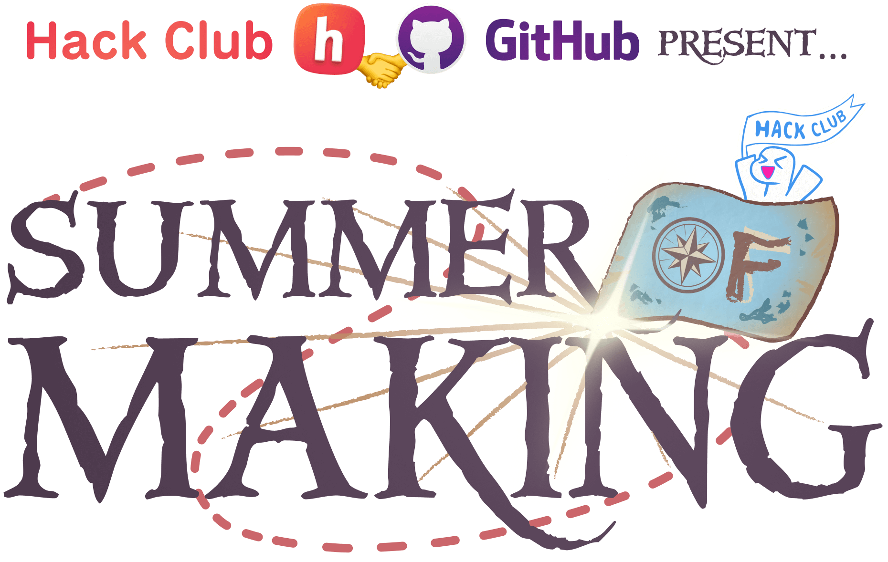
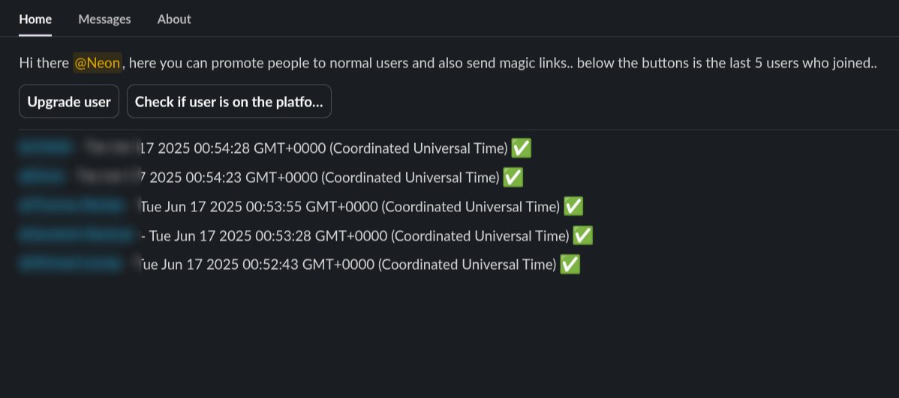

# Explorpheus

Explorpheus the bot which has been helping with getting people in the slack for the [Summer of Making '25](https://github.com/hackclub/summer-of-making) event to make sure people can get in and become a full member once verified!

This code is licensed under `MIT`!

## Host locally

1. populate env (slack, loops, random urls)
2. run `pnpm install`
3. run `pnpm start` :)

> [!NOTE]
> there is some hardcoded stuff which you will have to replace
